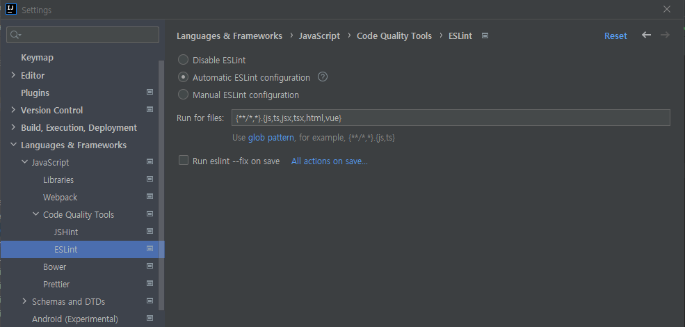
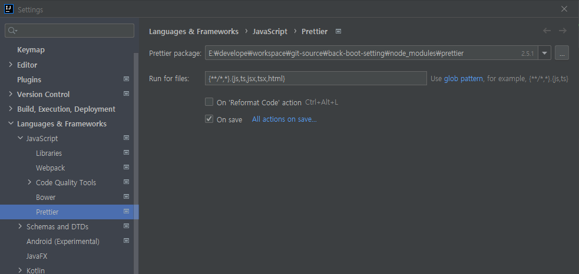

# 3.CodingConvention

### # 구현 내용
* elsint와 prettier 설정
  * IntelliJ
  * CSS, SCSS 적용 
  * 이미지 압축 처리
  * CleanWebpackPlugin 적용(빌드시 기존 DIST 삭제 처리)
  * BannerPlugin 적용(빌드시 배너 생성)
  * Define Plugin 적용(공통 변수 예제)
  * eslintIgnore 추가

<hr/>
  
### # 사용방법
dependencies를 설치해야 한다. npm이 설치된 상태에서 터미널에서 아래 구문을 실행 시킨다.

```
npm install
```

적용하려면 각자 사용하는 IDE에 eslint와 prettier 플러그인을 설치하고
적용을 해줘야 한다. 
intellij를 기준으로 한다면
- eslint는 setting < Languages & Frameworks < Javascript <Code Quality Tool < ESLint에서 Automatic으로 설정해주면 된다.

- prettier는 setting < Languages & Frameworks < Prettier 에서 On Save를 선택하면 된다.


혹시 Please specify path to 'eslint' package
이 구문이 나온다면
```
npm install --g eslint
```
전역설치를 해주고 IDE를 재실행하면 해결이 된다.


<hr/>

### # 권장사항
eslint는 강력한 코딩 규약이다 보니 원치 않는다면 이번 브랜치를 넘기는 걸 권장함.
그리고 각자 소속된 곳의 코딩 규약을 문서화 하시길 바람


